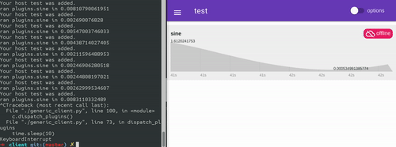

# Vapor Trail

Got some live data you want visualized? You like uncomplicated stuff? Maybe this is for you. It's like Twitter(tm) for logging. 

Use cases:
 * Have some computers you want to monitor? Have a live view into their stats.
 * IOT (sorry, buzzword): Have your router, weather station or doorbell send data and graph it.
 * Instead of graphing values, graph events, like CPU above 70%.
 * Aggregate different stock values
 * You have a mixed OS environment behind routers? If your machines have SSH, they can tunnel out to a relay to have access to them. No more dyndns.
 * Setting up some Raspberry Pis to report any data periodically
 * Monitor the progress of some task 

Features:

* Automatic detection and display for incoming data. "Widgets" are selected based on data type.
* Sample client and example plugins included
* Client/Server model: Server logs, Server frontent displays, client reports
* The server is a central hub to access and monitor your machines
* Superfast charts: Canvas rendering delivers realtime updates of dynamic data
* given sufficient network speed rendering can happen at 60 fps
* Responsive modern UI
* Logging data is as easy as opening http://yourhost.com/add?host=mydevice&temperature=300

## WIP:

* Android client support
* Rust server
 
## Setup

### Server
For the python server, you need python (obviously) and web.py.

### Client

In the simplest form, you can use anything that understands POST, such as curl:
`curl --data "host=testmachine2&ip=10.10.0.12" http://localhost:8080/add`

The only thing you really need is a "host" identifier. Everything else is up to you.

